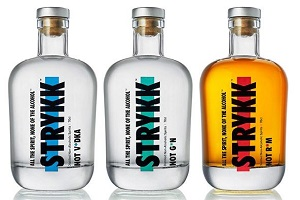
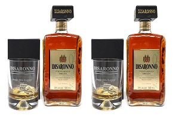
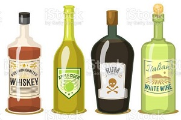
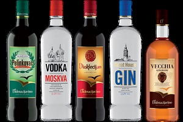

# Code for CTEC3905

index
└--_images
└--_javascript
└--_stylesheet
└--_pages

# 01 Week
Organaise coursework folder
- index.html
- _stylesheet
- _javascript
- _images
- _pages

index.html
	<header>
		<logo>
		</logo>
		<login>
		</login>
	</header>
	<nav>
		<button>
		</button>
		...
	</nav>
	<article>
	</article>
	<aside>
		<adds>
		</adds>
		...
	</aside>
	<footer>
		<social_network>
		</social_network>
	</footer>
	
	- link
		_stylesheet/style.css
		_javascript/script.js
		_images/*
		_pages/*
		
		
	style.css
	link the stylesheet folder and files with index.html by adding this script to head tage
	<link rel="stylesheet" type="text/css" href="_stylesheet/style.css">
	
	script.js
	link the javascript folder and files with index.html by adding this script to head tage
	
	
testing complete.

# 02 Week
Create navegation tages with domi pages, domi pages copy of index with change of titles and navigation link.

html code
		<nav>
			<button class="button _navbtn">
				<a href="#home">Home</a>
			</button>
			<button class="button _navbtn">
				<a href="#product">Products</a>
			</button>
			<button class="button _navbtn">
				<a href="#about_us">About Us</a>
			</button>
			<button class="button _navbtn">
				<a href="#rules_reg">Regulations
			</button>
			<button class="button _navbtn">
				<a href="#contact_us">Contact Us</a>
			</button>
			<button class="button _navbtn">
				<a href="#login">login</a>
			</button>
		
		</nav>
		
# 03 week
Changing the style sheet of the index file by moving the nav into horizontal line, to give spaces for alcohol pictures with description to be excuted and better designe for the website.

css code

/* Style the navigation */
nav
{
	width: 100%;
	height: 60px;
	border-radius: 12px;
	margin-right: 1%;
	margin-bottom: 2%;
	list-style-type: none;
}

changing the button.css file by adding this css codes.

	<link rel="stylesheet" type="text/css" href="_stylesheet/button.css">

css code

.button {
  background-color: #4CAF50; /* Green */
  float: right;
  border: none;
  color: white;
  padding: 5px;
  text-align: center;
  text-decoration: none;
  font-size: 16px;
  margin: 2px;
  cursor: pointer;
}

._navbtn {
	background-color: white; 
	color: black; 
	border: 2px solid #008CBA;
  	border-radius: 10px;
	width:150px;
}

# 04 week

customer approach with greeting message by ading this html codes to the index file.

html code

Animation
create a title animation by add this html codes in the header of index file.

html code

	<marquee style="color: black; ​font-style: italic; font-size: 30px;">
		Welcome to Al-khwabe provides Alcohol Trading services with different offers that suit your needs.
	</marquee>

Add the css codes in the stylesheet.css to link the animation of html code in the index file to stylesheet.css.
 
 css code
 
.header_anim
{
	float: left;
	width: 75%;
	margin-bottom: 1%;
}

# 05 week

Continue with changes in the index html and stylesheet.css file to create anaimation buttons

html code

#Buttons

<nav>
	<button class="button _navbtn">
		<a href="#home">Home</a>
	</button>
	<button class="button _navbtn">
		<a href="#product">Products</a>
	</button>
	<button class="button _navbtn">
		<a href="#about_us">About Us</a>
	</button>
	<button class="button _navbtn">
		<a href="#rules_reg">Regulations
	</button>
	<button class="button _navbtn">
		<a href="#contact_us">Contact Us</a>
	</button>
	<button class="button _navbtn">
		<a href="#login">login</a>
	</button>
		
</nav>

css code

.button {
  background-color: #4CAF50; /* Green */
  float: right;
  border: none;
  color: white;
  padding: 5px;
  text-align: center;
  text-decoration: none;
  font-size: 16px;
  margin: 2px;
  cursor: pointer;
}

a:hover {
  color: yellow;
  background-color: blue;
  text-decoration: underline;
}

/* Create two columns/boxes that floats next to each other */

aside
{
	float: right;
	width: 30%;
	height: 500px;
	background: #e6ffe6;
	padding: 2%;
	border-radius: 12px;
	margin-top: 1%;
	margin-bottom: 1%;
}

section
{
	height: 550px;
}

/* Style the footer */
footer
{
	background-color: #99d6ff;
	padding: 1%;
	color: #000000;
	border-radius: 12px;
	height: 90px;
}

/* Responsive layout - makes the columns/boxes stack on top of each other */

/* Extra small devices (phones, 480px and down) */ 
@media (max-width: 480px)
{
	nav, article, map, aside, .header_left, .header_mid, .header_right, .footer_left, .footer_right
	{
		width: 100%;
		height: auto;
	}
	
	nav
	{
		font-size: 20px;
	}
}

/* Devices (desktops/laptops, portrait tablets and large phones, 480px and up 960px) */
@media all and (max-width: 960px) and (min-width: 480px)
{
	.header_left, .header_mid, .header_right, .footer_left, .footer_right
	{
		width: 100%;
		height: auto;
	}
	
	nav
	{
		width: 30%;
		height: auto;
		font-size: 16px;
	}
	
	article, map
	{
		width: 67%;
		height: auto;
	}
	
	aside
	{
		display: none;
	}
}

# 06 week

create a canvas for the headrer logo of Al-khwabe webiste in the by adding the codes to index.html and stylesheet.css files.

html code with javascript code

canvas

<header>
	

		<canvas id="myWebTitle" width="300" height="45">
		</canvas>

		
	

</header>

css code

.header_logo
{
	float: left;
	width: 25%;
	margin-bottom: 1%;
	border-top: 2%;
}

Create an adds for the index.html file by adding this html codes.

<aside>
	<h4 style="text-align: center;" >Promotions & Avertisements</h4>

	

		

			
1 / 4

			
			 
			

				£45.57 and you will save 20%
				Just can't decide which bottle to pick? Get them all and complete the set.
				NOT G*N, NOT R*M & NOT V*DKA.
			

			
<a href="https://www.drinkstuff.com/products/product.asp?ID=28461&affID=56654444&prodID=28461&utm_term=&utm_campaign=Shopping+%7C+Cocktail+%7C+Smart&utm_source=adwords&utm_medium=ppc&hsa_acc=3671107430&hsa_cam=10650194388&hsa_grp=104808724683&hsa_ad=451441220596&hsa_src=u&hsa_tgt=pla-902752706384&hsa_kw=&hsa_mt=&hsa_net=adwords&hsa_ver=3&gclid=CjwKCAjwg4-EBhBwEiwAzYAlsmxUdntFE6oouft799SyM9fwPMsiMSbfwRLvnuuyvhvnvMhbMC_AbxoC34cQAvD_BwE#.YIQDr5BKjIU" target="_blank" >STRYKK TRIPLE</a>

			 
		

		

			
2 / 4

			
			 
			

				£35.99, Personalised Dimple Tumbler & 50cl Disaronno Amaretto - Disaronno Design
				The glass comes with Disaronno Design at the top of the glass.
			

			
<a href="https://www.thedrinksbasket.com/liqueur/amaretto-disaronno-liqueur-70cl.html?gclid=CjwKCAjwg4-EBhBwEiwAzYAlskl6hlloWZmu2iAbuwGWlJnioj561ivl-sBlh5e5OgBi3mcL4nffLRoCZnsQAvD_BwE" target="_blank" >Disaronno Amaretto</a>

			 
		

		

			
3 / 4

			
			 
			

				Key Features: The glass will come engraved using the font as shown in the photo.
				Option of a Grey Presentation Gift Box.
			

			
<a href="https://www.strykk.com/products/not-rum-funkin-pina-colada-shaker-400ml?variant=32313496928350&utm_source=google&utm_medium=cpc&utm_campaign=11205334540&utm_content=108797131806&utm_term=&gclid=CjwKCAjwg4-EBhBwEiwAzYAlsuZ-UQaWwLn4pThHAGAb7Hue2Hq2nFaJ2oL0m4yqe5t10m6_N4SXLhoChMgQAvD_BwE" target="_blank" >Cocktail</a>

			 
		

					
		

			
4 / 4

			
			 
			

				ZAGREB (Croatia), January 24 (SeeNews) - Croatian alcoholic beverages producer Badel 1862 said on Friday.
			

			
<a href="https://www.thewhiskyexchange.com/agegate/p/14366?source=&g_network=g&g_productchannel=online&g_adid=326288101633&g_acctid=734-378-4471&g_keyword=&g_adtype=pla&g_keywordid=pla-611215207656&g_ifcreative=&g_adgroupid=66874937218&g_productid=14366&g_merchantid=2444294&g_campaign=UK+-+Shopping+-+Other+Spirits&g_partition=611215207656&g_campaignid=1680006944&g_ifproduct=product&gclid=CjwKCAjwg4-EBhBwEiwAzYAlsj9OugmRchkm-m8hGKaq9F4458mWcQyEKOorC4GrcXGAwfAGQIt2CBoCZq0QAvD_BwE" target="_blank" >Badel 1982</a>

			 
		

	

	 

	

		 
		 
		
		
	

	
</aside>

link the stylesheet folder and files with index.html by adding this script to head tage to connect with stylesheet.css file to have a buttons for social media and have some key words for the website.

html code
		<title>Al-khwabe</title>
		
		<meta charset="utf-8">
		<meta name="viewport" content="width=device-width, initial-scale=1">
		<meta name="description" content="Al-khwabe alcohol trading sevices">
		<meta name="keywords" content="Al-khwabe, alcohol, Middle-East alcohol, Arak, Ozue, Spirits">
		<meta name="author" content="Abdo Maksoud">
		
		<link rel="stylesheet" type="text/css" href="_stylesheet/style.css">
		<link rel="stylesheet" type="text/css" href="_stylesheet/button.css">
		<link rel="stylesheet" type="text/css" href="_stylesheet/adds.css">
		<link rel="stylesheet" type="text/css" href="_stylesheet/sonet.css">
		<link rel="stylesheet" type="text/css" href="_stylesheet/forms.css">

# 07 week

Delete the about_us.html section to add the Google section in the navigation bar by adding the this html codes in the index.html file.

html code

<nav>
	<button class="button _navbtn">
		<a href="#home">Home</a>
	</button>
	<button class="button _navbtn">
		<a href="#product">Products</a>
	</button>
	<button class="button _navbtn">
		<a href="#contact_us">Contact Us</a>
	</button>
	<button class="button _navbtn">
		<a href="#login">login</a>
	</button>
	<button class="button _navbtn">
		<a href="http://www.google.com">Google</a>
	</button>
</nav>

Create the login section on index.html file that and linked to stylesheet.css 

		</section>
		
		<section>
			

				

					<form action="../php/login.php">
						

							<h1>Login</h1>
							

							<label for="email"><b>Email</b></label>
							<input type="text" placeholder="Enter Email" name="email" id="email" required>
							 
							<label for="psw"><b>Password</b></label>
							<input type="password" placeholder="Enter Password" name="psw" id="psw" required>
							

							<button type="submit" class="registerbtn">Login</button>
						

					</form>
				

				

					<form action="../php/registeration.php">
						

							<h1>Register</h1>
							
Please fill in this form to create an account.

							

							<label for="email"><b>Email</b></label>
							<input type="text" placeholder="Enter Email" name="email" id="email" required>
							 
							<label for="psw"><b>Password</b></label>
							<input type="password" placeholder="Enter Password" name="psw" id="psw" required>
							 
							<label for="psw-repeat"><b>Repeat Password</b></label>
							<input type="password" placeholder="Repeat Password" name="psw-repeat" id="psw-repeat" required>
							

							
By creating an account you agree to our <a href="#">Terms & Privacy</a>.

							<button type="submit" class="registerbtn">Register</button>
						

					</form>
				

			

		</section>

organise the index.html codes by moving all the Javascript to the _javascript.js file with proper link in index file.

		<footer>
			

				

				Copyright@ Al-khwabe alcohol trading sevices
				<a href = "mailto: s45456166@sccb.ac.uk">Send Email</a>
			

						
			
	
				
				
				
				
			

		</footer>
		
		
		
		
		

# 08 week

Edit the footer of the HTML file by connecting to Jason file and linked with javascript files called social_network

<footer>
	

		

			

			Copyright@ Al-khwabe alcohol trading sevices
			<a href = "mailto: s45456166@sccb.ac.uk">Send Email</a>
		

				
		

	

</footer>

javascript file linked with:

			

Edite the css style file by changing the css code to:

footer
{
	background-color: #f2d9e6;
	height: 125px;
	width: 100%;
	padding: 10px;
	font-size: 12px;
	border-radius: 5px 25px 10px;
}

#footer_left
{
	float: left;
	width: 50%;
	text-align: left;
	padding: 10px;
}

#soc_net
{
	padding: 2%;
	float:right;
}

# 09 week

completeing all the parts of the parts and design of the page 